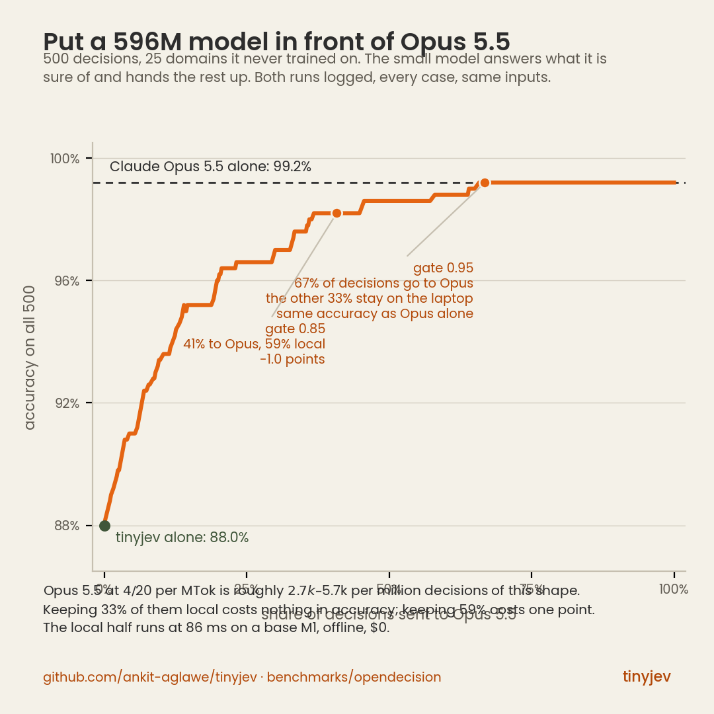

# tinyjev on OpenDecision's Original Choice 500

Every model here answered the same 500 questions, with the same option lists, from the
same files, scored by the same code. The rows tinyjev loses to are in the table.

## The suite

[OpenDecision](https://github.com/deepanwadhwa/OpenDecision) publishes a 500-case choice
suite: 25 domains, 20 cases each, 3 to 10 options per case, split 75/25 within every domain
with seed 20260918. Files are copied verbatim into [`suite/`](suite/) and pinned:

```
cd7372e594fce7a5464c3eb3edc73db45c309c8a67e7eef7daf78ec97288edeb  cases.jsonl
de92fc6bcb8a1e51bcfab479a4feb1a7300c82c292c6b27895f16ff1123b69cb  dev.jsonl
5addda660a55f611216f46c971fbc64f50e1eb7a16b2dd62079550b0f8e51ad3  holdout.jsonl
```

**Contamination.** tinyjev was trained on Kev's `decision-v7` split, whose ten sources are
banking77, boolq, ag_news, multi_nli, sst5, yelp, trec, dbpedia_14, amazon_reviews_multi_en
and imdb. None of them is OpenDecision, and OpenDecision's cases are synthetic. tinyjev's
served temperature (1.464) was fitted on a decision-v7 calibration partition, not here.
Nothing on this page was used to train, select or calibrate the model; the gate of 0.85 is
the README default since 0.1.0. No number here was chosen after looking at it.

## Results

<!-- TABLE:start -->
| model | correct / 500 | accuracy (95% CI) | dev | holdout | ECE | Brier | gate ≥0.85: coverage @ accuracy | coverage at ≤2% error | mean latency |
|---|---:|---:|---:|---:|---:|---:|---:|---:|---:|
| claude-opus-5-5 | 496 | 0.992 [0.984, 0.998] | 371/375 | 125/125 | 0.070 | 0.017 | 95.4% @ 1.000 | 100.0% | cloud |
| kev-0.8b | 463 | 0.926 [0.902, 0.948] | 349/375 | 114/125 | 0.189 | 0.176 | 37.2% @ 1.000 | 72.8% | 173 ms |
| lostargon-tiny-jev | 445 | 0.890 [0.862, 0.916] | 338/375 | 107/125 | 0.041 | 0.173 | 81.6% @ 0.951 | 62.2% | 1979 ms |
| kev-0.6b | 441 | 0.882 [0.854, 0.910] | 330/375 | 111/125 | 0.025 | 0.158 | 75.6% @ 0.982 | 76.0% | 85 ms |
| tinyjev-0.6b-int8 | 440 | 0.880 [0.852, 0.908] | 330/375 | 110/125 | 0.066 | 0.179 | 59.4% @ 0.980 | 63.2% | 90 ms |
| **tinyjev-0.6b** | 440 | 0.880 [0.850, 0.906] | 330/375 | 110/125 | 0.071 | 0.178 | 59.2% @ 0.980 | 63.4% | 86 ms |
| opendecision-engine | 428 | 0.856 [0.824, 0.886] | 319/375 | 109/125 | 0.151 | 0.255 | 28.4% @ 0.979 | 43.6% | 683 ms |
| agent-jev-0.6b | 415 | 0.830 [0.796, 0.860] | 306/375 | 109/125 | 0.358 | 0.434 | 2.0% @ 0.600 | 0.2% | 384 ms |
| von-1.2 | 414 | 0.828 [0.794, 0.860] | 310/375 | 104/125 | 0.068 | 0.271 | 69.2% @ 0.913 | 33.2% | 343 ms |
| laya-typed-decisions | 395 | 0.790 [0.754, 0.826] | 296/375 | 99/125 | 0.305 | 0.430 | 3.8% @ 1.000 | 33.6% | 125 ms |
| laya-english | 367 | 0.734 [0.694, 0.774] | 276/375 | 91/125 | 0.053 | 0.377 | 35.2% @ 0.960 | 31.6% | 138 ms |
| qwen3-0.6b-base-logit-readout | 354 | 0.708 [0.668, 0.748] | 260/375 | 94/125 | 0.102 | 0.424 | 15.8% @ 0.975 | 20.4% | 265 ms |
| nanojev | 114 | 0.228 [0.192, 0.264] | 83/375 | 31/125 | 0.033 | 0.836 | 0.8% @ 0.000 | 0.0% | 325 ms |
<!-- TABLE:end -->

Accuracy CIs are 2,000-resample bootstraps over cases. ECE is 10-bin, on the top
probability. Brier is multiclass over each case's own options. "Coverage at ≤2% error" is
the largest share of the queue the model can answer on its own, ordered by its own
confidence, while staying at or under 2% wrong: the number a person deciding what to
automate actually needs, and the one that does not depend on where you put the gate.

Two rows need reading with care. **Claude Opus 5.5** reported its probabilities in the
JSON it returned; they are not logits, and its latency was not measured per case (twenty
parallel workers answered 25 cases each). **nanojev** is trained on game state, not text;
it is here because it shares the backbone, not because it is a text baseline.

## How each row was produced

<!-- HOWRUN:start -->
- **claude-opus-5-5** — frontier model, cloud; probabilities are self-reported in its JSON answer, not logits. runtime: Claude Code subagents on the author's subscription, model override claude-opus-5-5, effort low, structured output; probabilities: SELF-REPORTED by the model in its JSON answer, not logits; latency: not measured per case: 20 agents x 25 cases in parallel, 77.6 s wall-clock total; ms below is null
- **kev-0.8b** — Kev's current small model, Qwen3.5 base, via Kev's own server on torch. runtime: systemone-http; url: http://127.0.0.1:8009/v1/systemone; note: jaredpalmer/kev-0.8b (Qwen3.5-0.8B, DeltaNet) via Kev's own kev.serve, bf16, torch on Apple Silicon; ran alongside other jobs so ms is noisy
- **lostargon-tiny-jev** — the other 'Tiny-Jev' on Hugging Face (name collision), its own custom head. runtime: transformers; checkpoint: lostargon/Tiny-Jev; device: cpu
- **kev-0.6b** — the checkpoint tinyjev reproduces; served at T=1.0 (no fitted temperature in the converted manifest). runtime: tinyjev 0.1.3; backend: mlx; temperature: 1.0; checkpoint: tinyjev-kev-0.6b (tinyjev-v2 conversion, local)
- **tinyjev-0.6b-int8** — this repo, MLX INT8 backbone. runtime: tinyjev 0.1.3; backend: mlx; quantize: 8; temperature: 1.4640856959456252; checkpoint: AnkitAI/tinyjev-0.6b@0fdb9ea
- **tinyjev-0.6b** — this repo, MLX fp16, served temperature 1.464. runtime: tinyjev 0.1.0; backend: mlx; temperature: 1.4640856959456252; checkpoint: AnkitAI/tinyjev-0.6b@0fdb9ea
- **opendecision-engine** — the suite owner's own engine, ModernBERT-large zero-shot NLI, default profile. runtime: opendecision 0.1.1; profile: default
- **agent-jev-0.6b** — Qwen3-0.6B with a permutation-equivariant set head, via the author's engine on MPS. runtime: systemone-http; url: http://127.0.0.1:8011/v1/systemone; note: aimeigaoshou/agent-jev fp32 via the author's DecisionEngine behind a 47-line /v1/systemone shim, MPS; ran alongside other jobs so ms is noisy
- **von-1.2** — ModernBERT-Large 395M, own weights, via von-sdk. runtime: von-sdk
- **laya-typed-decisions** — Laya's typed-decisions checkpoint via `pip install laya`. runtime: laya 0.3.20; checkpoint: convaiinnovations/laya/typed-decisions; note: English ModernBERT-large checkpoint, default device
- **laya-english** — Laya's English ModernBERT-large checkpoint via `pip install laya`. runtime: laya 0.3.20; checkpoint: convaiinnovations/laya; note: English ModernBERT-large checkpoint, default device
- **qwen3-0.6b-base-logit-readout** — the untrained backbone, options lettered, next-token letter logits. runtime: mlx-lm; backbone: Qwen/Qwen3-0.6B-Base; recipe: options lettered A..J, prompt ends 'Answer:', softmax over next-token logits of the letter tokens
- **nanojev** — a games-state model on the same backbone; included as the third head, not as a text baseline. runtime: tinyjev 0.1.3; backend: mlx; checkpoint: tinyjev-nanojev (tinyjev-v2 conversion, local)
<!-- HOWRUN:end -->

Adapters are in [`adapters/`](adapters/), one per runtime, all writing the schema in
[`common.py`](common.py). Local rows ran on a base M1 (16 GB) one model at a time except
where the note says otherwise, so latency columns compare only within a runtime.

## In front of a frontier model

The use these models are actually for. tinyjev answers every case it is at least `gate`
sure of; Claude Opus 5.5 answers the rest. Counted from the two logged runs on the same
500 cases (`cascade.py`, full curve in `results/cascade.csv`):

<!-- CASCADE:start -->
| gate | stays local | sent to Opus | cascade accuracy | Opus alone | delta |
|---:|---:|---:|---:|---:|---:|
| 0.60 | 83.6% | 16.4% | 95.2% | 99.2% | -4.0 |
| 0.70 | 75.8% | 24.2% | 96.6% | 99.2% | -2.6 |
| 0.80 | 64.4% | 35.6% | 97.8% | 99.2% | -1.4 |
| 0.85 | 59.2% | 40.8% | 98.2% | 99.2% | -1.0 |
| 0.90 | 47.8% | 52.2% | 98.6% | 99.2% | -0.6 |
| 0.95 | 33.2% | 66.8% | 99.2% | 99.2% | +0.0 |
| 0.99 | 10.8% | 89.2% | 99.2% | 99.2% | +0.0 |
<!-- CASCADE:end -->

tinyjev alone is 88.0%. Opus alone is 99.2%. At a 0.95 gate the cascade is also 99.2%
with a third of the decisions never leaving the laptop; at 0.85 it is 98.2% with 59%
staying local. tinyjev put 54 of its 60 errors below the 0.85 gate on its own, which is
why the hand-off works. At Opus 5.5's list price this shape of request is roughly
$2.7k–$5.7k per million decisions (192 input and 97–247 output tokens each, estimated
with a proxy tokenizer); the local share is $0.



## Where the temperature came from, and what it costs out of distribution

tinyjev serves `logits / 1.464`, a temperature fitted by Kev's trial scorer on the
decision-v7 calibration partition, in distribution. Re-tempering the logged run offline
(`temperature.py`) shows that fit does not survive this suite:

<!-- TEMPERATURE:start -->
| factor | effective_T | accuracy | ece | gate85_coverage | gate85_accuracy | cov_at_2pct | cov_at_5pct |
|---:|---:|---:|---:|---:|---:|---:|---:|
| 0.8 | 1.8301 | 0.88 | 0.1247 | 0.416 | 0.9808 | 0.61 | 0.814 |
| 1.0 | 1.4641 | 0.88 | 0.0706 | 0.592 | 0.9797 | 0.634 | 0.854 |
| 1.2 | 1.2201 | 0.88 | 0.0369 | 0.67 | 0.9731 | 0.65 | 0.854 |
| 1.4640856959456252 | 1.0 | 0.88 | 0.0193 | 0.756 | 0.963 | 0.672 | 0.846 |
| 1.8 | 0.8134 | 0.88 | 0.0394 | 0.812 | 0.9581 | 0.69 | 0.848 |
| 2.2 | 0.6655 | 0.88 | 0.0562 | 0.844 | 0.955 | 0.696 | 0.852 |
<!-- TEMPERATURE:end -->

`effective_T 1.0` is the raw logits. Accuracy cannot change with temperature; calibration
and gate coverage can, and they do: at the served temperature the model is under-confident
here (ECE 0.071, 59% of the queue clears 0.85), at raw logits it is nearly calibrated
(ECE 0.019, 76% clears the gate) and matches Kev-0.6B's coverage. That is the whole
difference between the two rows; it is the same model class with the same behaviour.

This is a finding, not a fix. Refitting the temperature on the suite you are reporting
would be fitting to the test set. The next release fits it on a held-out
out-of-distribution partition and reports both. Until then, `agent.predict(payload,
temperature=1/1.464)` gives you the raw logits.

## Per domain

Counts out of 20. The two relational domains are near chance for every small model on
the page; that is the failure mode that matters.

<!-- DOMAINS:start -->
| domain | tinyjev-0.6b | Kev-0.6B | raw readout | Opus 5.5 |
|---|---:|---:|---:|---:|
| citation_relation | 9/20 | 9/20 | 9/20 | 20/20 |
| entity_matching | 9/20 | 8/20 | 8/20 | 19/20 |
| policy_decision | 14/20 | 14/20 | 7/20 | 18/20 |
| email_intent | 15/20 | 15/20 | 17/20 | 20/20 |
| date_semantics | 16/20 | 15/20 | 6/20 | 20/20 |
| database_intent | 17/20 | 18/20 | 13/20 | 20/20 |
| appliance_issue | 18/20 | 18/20 | 16/20 | 19/20 |
| meeting_intent | 18/20 | 19/20 | 14/20 | 20/20 |
| science_phenomenon | 18/20 | 18/20 | 16/20 | 20/20 |
| security_event | 18/20 | 19/20 | 16/20 | 20/20 |
| software_bug | 18/20 | 19/20 | 11/20 | 20/20 |
| support_routing | 18/20 | 19/20 | 15/20 | 20/20 |
| transaction_type | 18/20 | 18/20 | 16/20 | 20/20 |
| document_type | 19/20 | 18/20 | 6/20 | 20/20 |
| function_routing | 19/20 | 19/20 | 13/20 | 20/20 |
| logistics_exception | 19/20 | 19/20 | 18/20 | 20/20 |
| manufacturing_defect | 19/20 | 19/20 | 15/20 | 20/20 |
| ml_task | 19/20 | 20/20 | 12/20 | 20/20 |
| semantic_extraction | 19/20 | 18/20 | 20/20 | 20/20 |
| contract_clause | 20/20 | 20/20 | 19/20 | 20/20 |
| job_family | 20/20 | 20/20 | 16/20 | 20/20 |
| product_taxonomy | 20/20 | 20/20 | 18/20 | 20/20 |
| research_method | 20/20 | 20/20 | 18/20 | 20/20 |
| return_reason | 20/20 | 20/20 | 15/20 | 20/20 |
| word_sense | 20/20 | 19/20 | 20/20 | 20/20 |
<!-- DOMAINS:end -->

## Reproduce

```bash
pip install 'tinyjev[mlx]'                       # or [torch]
cd benchmarks/opendecision
python adapters/tinyjev_runtime.py               # results/tinyjev-0.6b.jsonl
python adapters/tinyjev_runtime.py --quantize 8
python adapters/raw_qwen_readout.py              # needs mlx-lm
python summarize.py                              # summary.json, coverage.csv, baselines.csv
python temperature.py tinyjev-0.6b               # temperature.csv
python render_readme.py                          # this page and the README block
```

The other adapters name their own requirements at the top of the file; each runs in its
own environment because their dependencies do not agree with each other.

Result files: [`results/summary.json`](results/summary.json) (everything above, per model),
[`results/baselines.csv`](results/baselines.csv), [`results/coverage.csv`](results/coverage.csv)
(the full coverage-vs-error curve for every model at every threshold), and one
`results/<model>.jsonl` per row with a probability for every option of every case.
